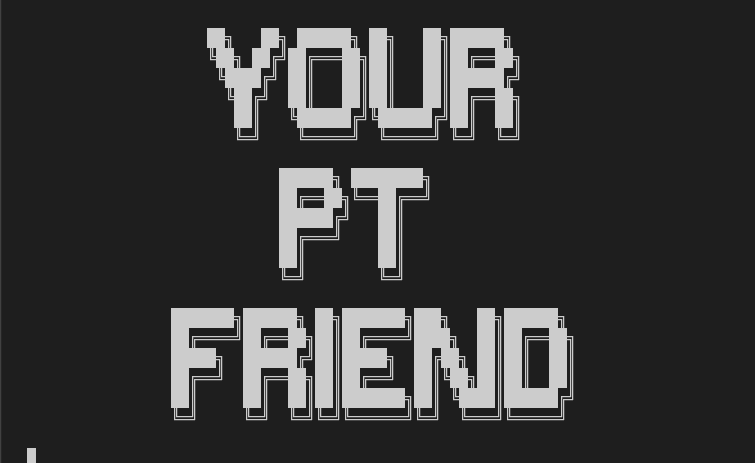

# YourPTFriend

**A Python based program to support Personal Trainers in their job**

[View the program here]()

## TABLE OF CONTENTS

1. [INTRODUCTION](#1-introduction)
2. [INSTRUCTIONS](#2-instructions)
3. [PROGRAM GOALS](#3-program-goals)
4. [FEATURES](#4-features)
   - [Existing features](#existing-features)
   - [Features to implement in the future](#features-to-implement-in-the-future)
5. [TESTING](#5-testing)
6. [TECHNOLOGIES USED](#6-technologies-used)
7. [CREDITS](#6-credits)
8. [DEPLOYMENT](#7-deployment)
9. [ACKNOWLEDGEMENTS](#8-acknowledgements)

- - - 
## 1. INTRODUCTION

YourPTFriend is an interactable command-line based program built in python that handles data automation as a supporting tool for personal trainers.

Based on the client's data provided by the PT, the program calculates the client's TDEE and, based on the weight goal (maintenance, cutting, bulking) it returns the amount of daily calorie intake that the client should consume.

The program also allows the user to periodically check the progress of a specific client, or to delete a client from the records when they decide to end the coaching.

The program goal is to automate a repetitive task related to nutrition so that the user (the PT) can entirely focus on designing the workouts.

## 2. INSTRUCTIONS

## 3. PROGRAM GOALS

## 4. FEATURES

## 5. TESTING

## 6. TECHNOLOGIES USED

## 7. CREDITS

## 8. DEPLOYMENT

## 9. ACKNOWLEDGEMENTS