# YourPTFriend

**A Python based program to support Personal Trainers in their job**

[View the live program here](https://your-pt-friend.herokuapp.com/)

## TABLE OF CONTENTS

1. [INTRODUCTION](#1-introduction--goal)
2. [INSTRUCTIONS](#2-instructions)
3. [USER STORIES](#3-user-persona--their-goalsneeds)
4. [FLOWCHART AND PROGRAM LOGIC](#4-flowchart-and-app-logic)
   - [Flowchart](#flowchart)
   - [App logic](#app-logic)
5. [FEATURES](#5-features)
   - [Existing features](#existing-features)
   - [Features to implement in the future](#features-to-implement-in-the-future)
6. [TESTING](#6-testing)
7. [TECHNOLOGIES USED](#7-technologies-used)
8. [CREDITS](#8-credits)
9. [DEPLOYMENT](#9-deployment)
10. [ACKNOWLEDGEMENTS](#10-acknowledgements)

- - - 
## 1. INTRODUCTION & GOAL

__YourPTFriend__ is an interactable command-line based program built in Python that handles data automation as a _supporting tool for Personal Trainers_.

Since working out and nutrition go hand in hand, it happens very often that physical instructors are also required, besides their duties, to provide nutritional advice when first contacted.

This app provides support by taking charge of that nutritional aspect. By establishing the amount of daily calories a new client should consume and keeping track of the clients' progress,
the PT can then entirely focus on his/her main responsibility: 
building an effective workout plan based on the client's need.
- - - 
## 2. INSTRUCTIONS
The user can decide to:

1) __Add a new client to the records and obtain his/her daily calorie intake.__
The coach needs to provide a specific set of data (client's name, gender, age, height, weight, activity level, body fat and goal) for the program to calculate the right output. Data is then stored on a worksheet that contains all clients and their data.

2) __Periodically check a client's progress based on the weight goal and body fat percentages recorded.__
New weight and body fat percentages are required from the user.

3) __Delete a client from the records.__ 
Client's name is required.
- - - 
## 3. USER PERSONA & THEIR GOALS/NEEDS
As a user I want to:
- have clear instructions/prompts on how to use the app
- be required to insert information that is easy and quick to gather and doesn't involve processing from my side
- obtain an accurate assessment of my clients' recommended daily calorie intake 
- obtain a reliable evaluation of my clients' progress
- have the option to choose another task after I'm finished with the current action
- have my inputs checked and validated so that the task outputs are even more reliable

[Back to top ↑](README.md/#yourptfriend)
- - - 
## 4. FLOWCHART AND APP LOGIC
### Flowchart
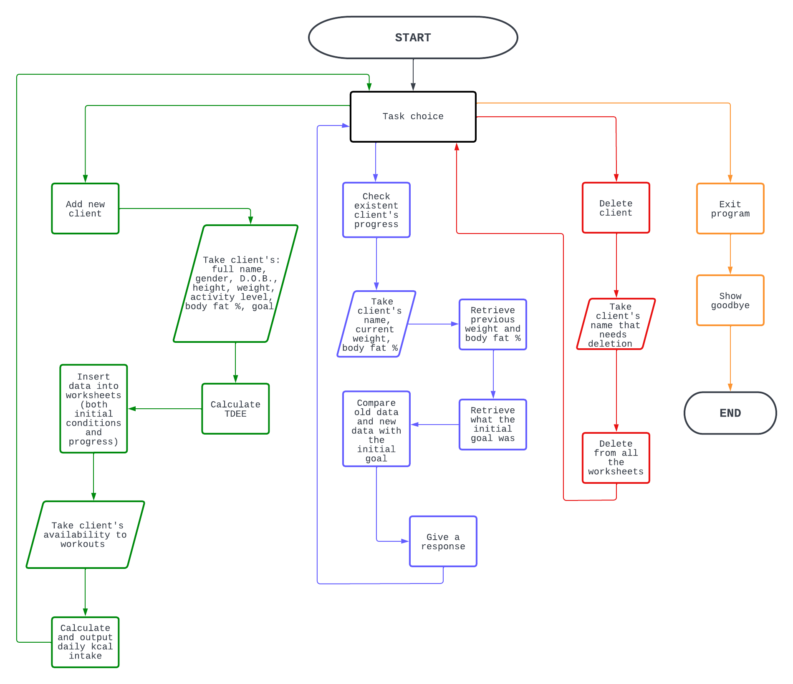

The flowchart above was designed to have a guide to follow during the program building process and to show how the app works from start to finish.

### App logic

#### - __Formulas__
When adding a new client, __the program's main output is the client's daily calorie intake__. 
To calculate this, two pieces of data are needed:
1) __TDEE__ (Total Daily Energy Expenditure): it's the amount of calories needed for that client to function. It's the result of the sum of three factors:
- _BRM_(Basal Metabolic Rate): 
   it's the result of LBM (Lean Body Mass, different formulas for men and women) * 21.6 + 370
- _TEF_ (Termic Effect Of Food, 10% of bmr) 
- _TEA_ (Termic Effect of activity): based on the activity level and the related factor

All data requested to the user is needed for these formulas, contained in a separate module (tdee_formulas.py) and imported into the main run.py file.

2. Client committment/Availability:
Considering an estimated 300kcal burnt per workout, it determines an average of calories burnt per week due to working out (based on how many days x week of committment are inputted) and divides it by 7 to obtain the amount (avg) of calories burnt per day.

So the daily calories burnt are added to the TDEE and based on the goal, 500kcal are added or removed (or nothing gets changed) from that total so that the program outputs a recommended daily calorie intake.
   
#### - __Worksheets for storing data__

The program makes use of the gspread library to access a Google Sheets file that allows the program to push and pull data based on the task that it needs to work on.

The file contains two worksheets:

- Clients initial conditions Worksheet
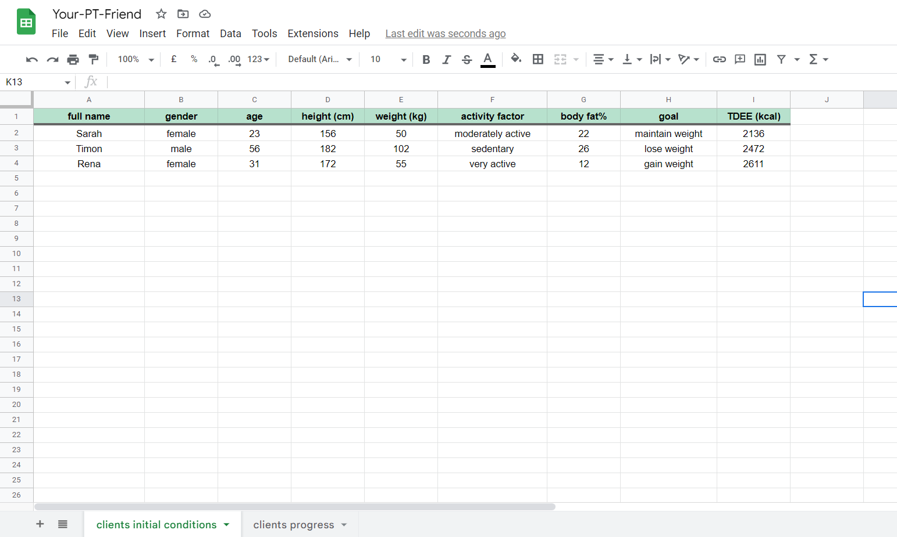

Used to store all clients' data and needed when the program needs to retrieve the client's goal or delete a client from the records. 
- Clients progress
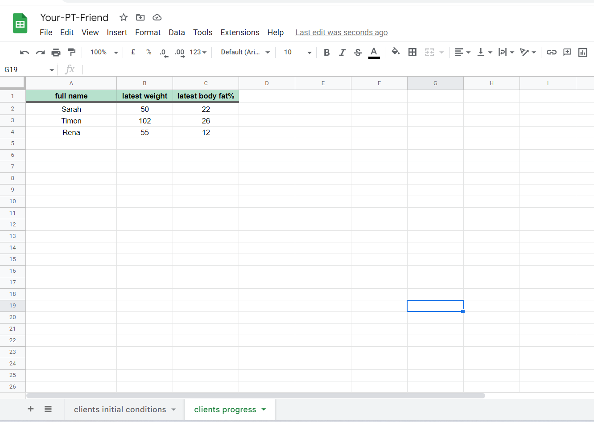

This worksheet is used to store the latest inserted body weight and body fat of each client so that the program can retrieve them and compare them with the new data that the user is inserting to calculate a client's progress.

[Back to top ↑](README.md/#yourptfriend)
- - - 
## 5. FEATURES

### EXISTING FEATURES 

- __START SCREEN__
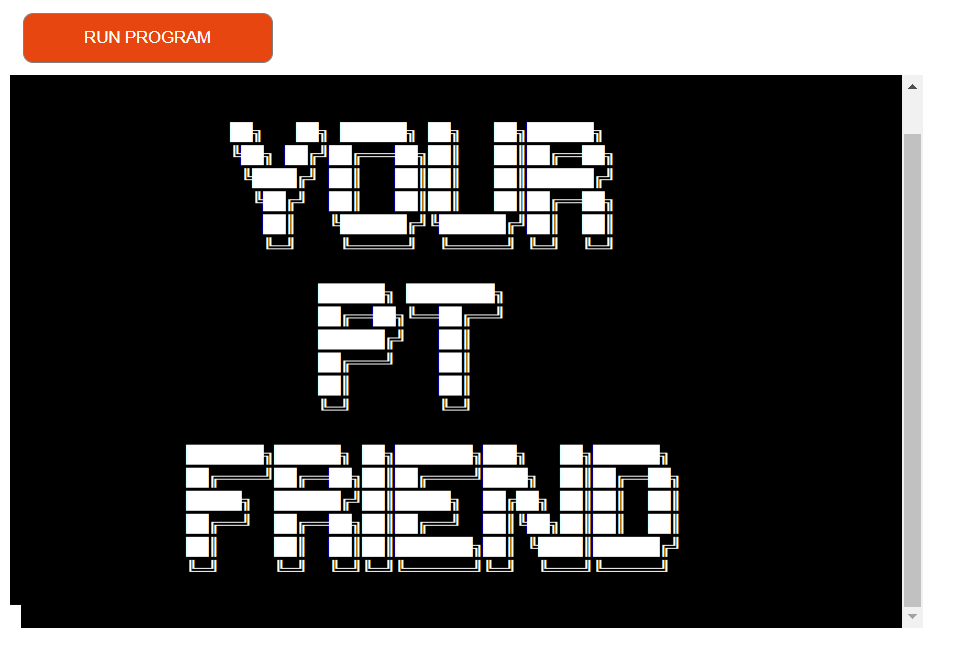

The start screen displays the app name through an __ASCII art text__
that shows for the duration of _3.5 seconds_ (an appropriate time for allowing the user to take in the intro and at the same time not to get impatient) before the screen is cleared to show the next screen.

- __TASK CHOICE__
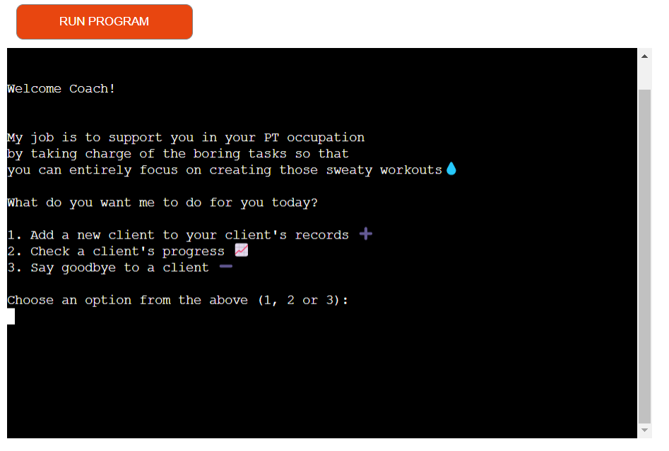

The introductory screen contains a brief explanation of the app's goal and prompts the user to choose between __3 different tasks__ that the app can perform.
Each option is accompanied by an _emoji_, for the purpose of making the app more engaging.

- __OPTION 1: ADD A NEW CLIENT__
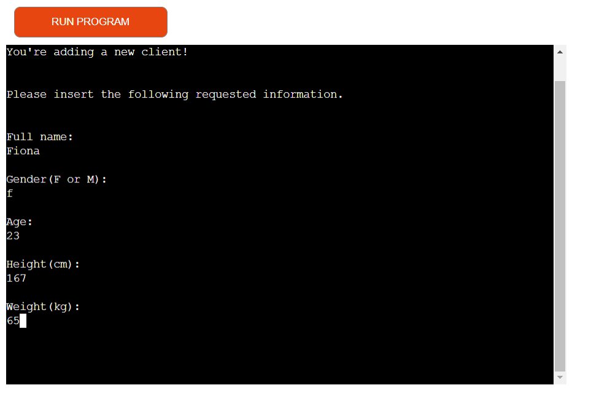

When choosing the option to add a new client to the records, the PT is asked for the client's name, gender, age, height and weight.
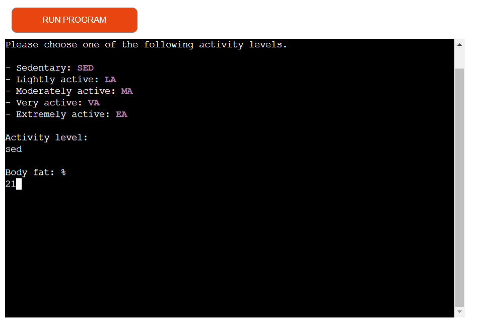

The next piece of information requested is the client's activity level. The answer needs to be the activity level's initials, as prompted from the magenta coloured foreground color of the answer options available.
Also the body fat percentage is requested on this screen.
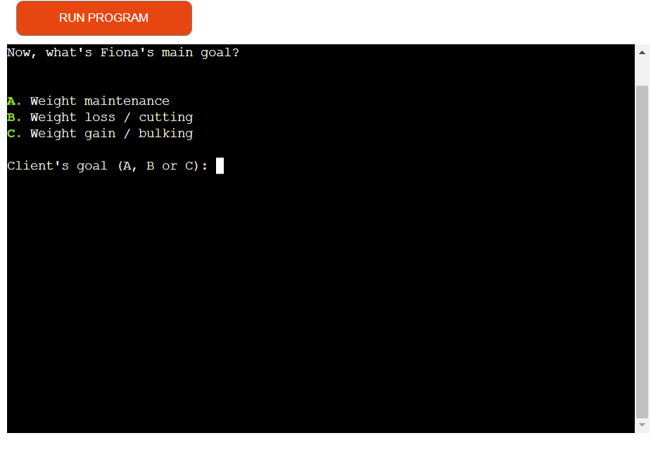

The last data needed is the client's goal regarding the body weight. The client's name inserted on the previous screens is retrieved and displayed here to make the process less sterile. 3 options are made available and the answer needs to be one of the letters highlighted by the green foreground color.
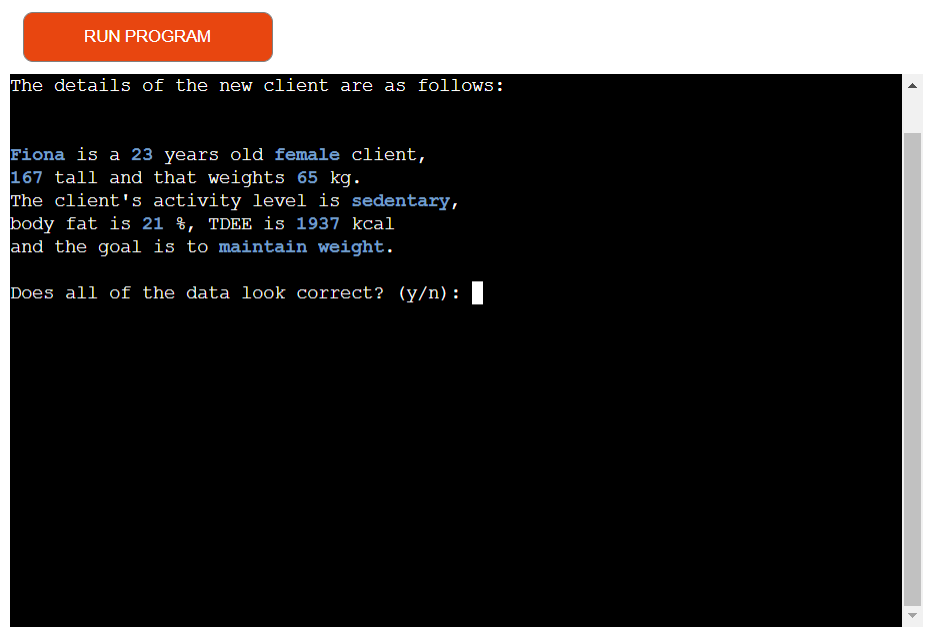

The user is asked for confirmation of all of the inserted data before proceeding.
The inputted data are highlighted in a foreground blue color, that makes it easier to identify wrongly inserted data.

If the data is incorrect and the user inserts 'n', then all data will be asked again.
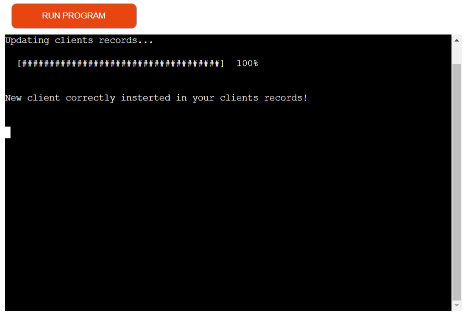

After approving the inserted data, the user is brought to a screen that confirms the successfull updating of the clients records.
This screen features a progress bar that has the purpose of giving the user a sense of awareness about the action that is happening behind the scenes.
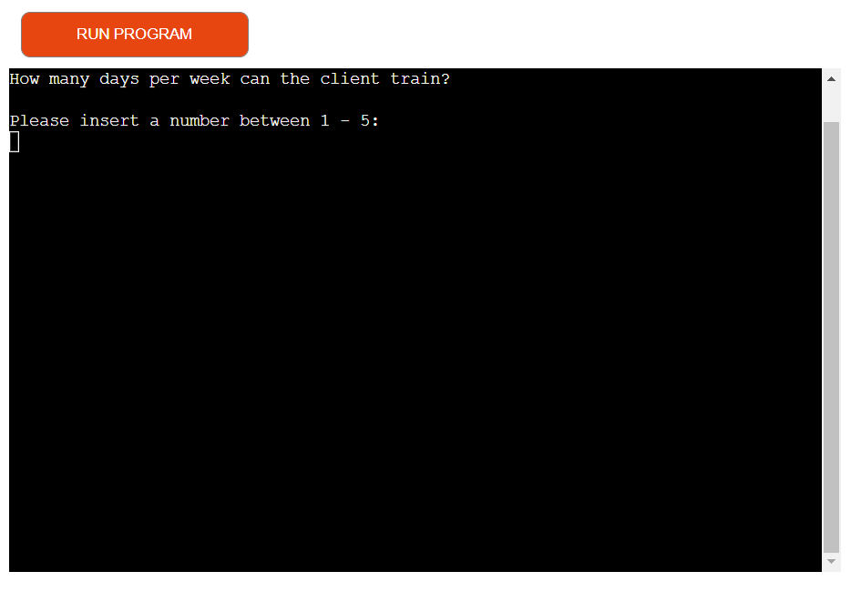

The user is then prompted to inserting the client's committment to physical activity, choosing between 1 to 5 days per week. This piece of information is essential for calculating the daily calorie intake.
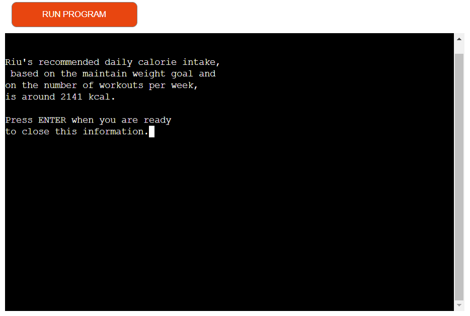

Finally, the newly added client's tailored daily calorie intake is displayed as the last feature of the adding a new client process. 
The result is displayed alone on the screen for 2 seconds, so that the information displayed has time to be fully absorbed and the user doesn't feel rushed by the control for closing the screen that would have otherwise appeared straight away.

[Back to top ↑](README.md/#yourptfriend)

- __OPTION 2: CHECK A CLIENT'S PROGRESS__

The first piece of information requested for checking a client's progress is the client's name, to make sure that he/she exists in the records.
The user is then made aware that the latest body weight and fat are being retrieved.

The user is then prompted to insert the new weight and body fat percentage for the program to compare the old and the new data.
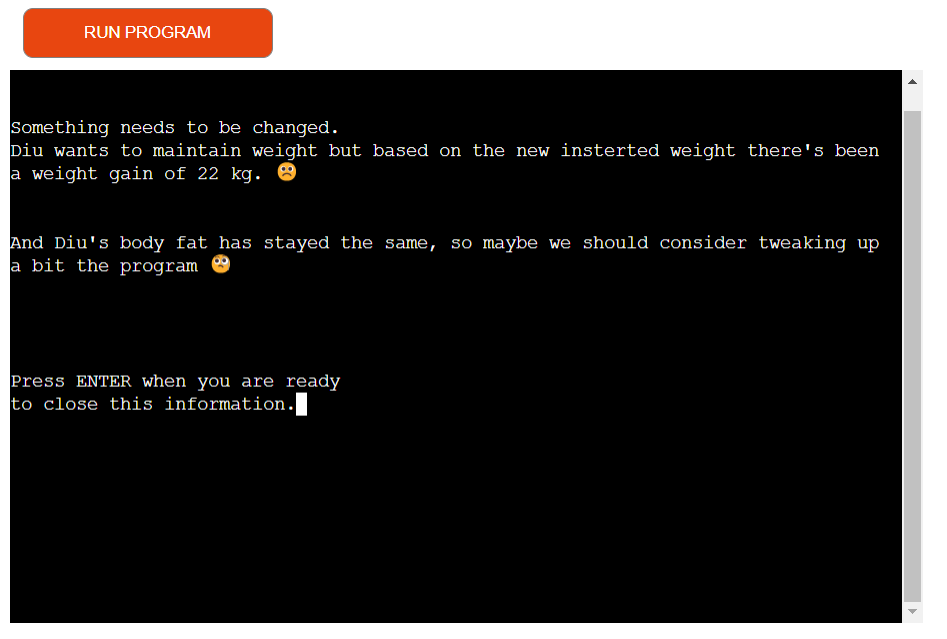

The progress results are showed one after the other, with a little pause in between (2 seconds) to give the user time to absorb the first response and give it the necessary importance.

- __OPTION 3: DELETE A CLIENT__
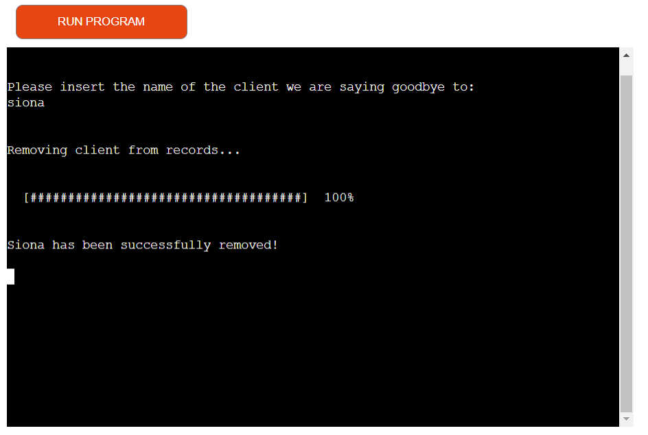

After the user inserts the name of the client to delete, and is showed that the operation is being processed, a confirmation of deletion appears on the screen.

- __OPTION 4: EXIT__
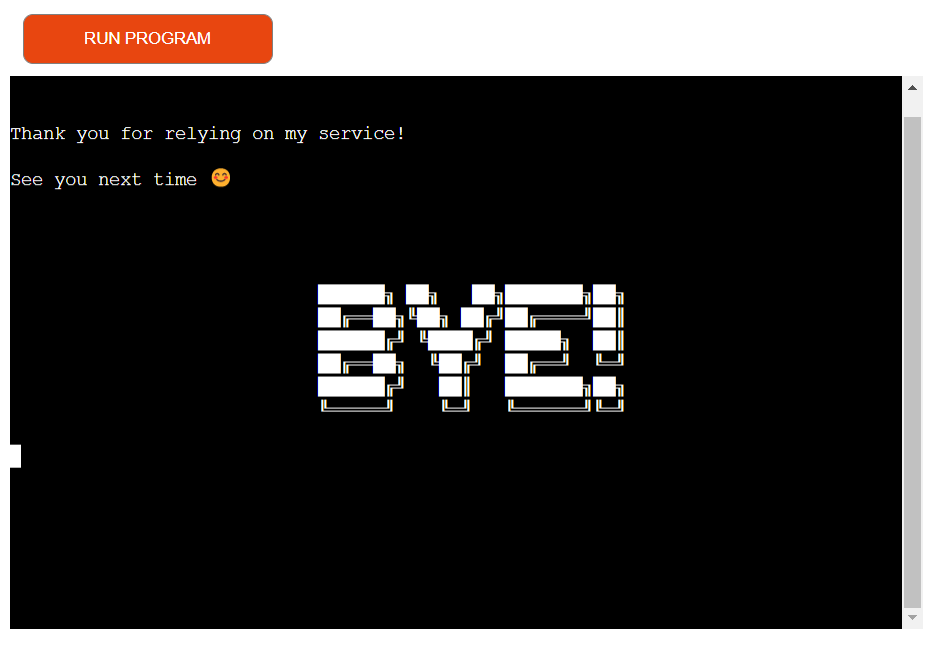

This screen thanks the user for using the program and uses an ASCII art text to give goodbyes.
- - - 

### FEATURES TO IMPLEMENT IN THE FUTURE

Possible future improvements for the program would be:

- Adding an option for the PT to retrieve an organized table containing all the clients in the records and their data.

- Inserting in the records also the date when the client registration occured and when a new set of data (weight and body fat) is inserted, so that the progress takes into account also the amount of time that has passed for that progress to occur and, maybe, inserting a functionality that checks how "healthy" is the progress obtained (i.e.: losing too much weight in a short amount of time is unhealthy and not sustainable etc.)

- Expanding the client's possible goal (improving aerobic activity, endurance, preparing for competition etc.) and outputting a guidance of the training plan that the PT could use to build the single workouts

- Improving the data validation when adding a new client, for example comparing the weight and height inserted to check if they are realistic/possible.

- The chance to only change the wrong piece of inputted data when the user doesn't confirm the new client data for adding a new client, instead of having to reinsert all of them. 

[Back to top ↑](README.md/#yourptfriend)

---

## 6. TESTING

All of the information regarding the testing can be found [here](TESTING.md).
- - -
## 7. TECHNOLOGIES USED

### Main languages used:

__Python__ is the programming language used to create this project

### Python Modules and APIs:

- [os](https://docs.python.org/3/library/os.html) : used to clear the terminal to improve user experience
- __sleep__ function from the [time](https://docs.python.org/3/library/time.html) module: to suspend execution for a specific amount of time and improve ux
- [sys](https://docs.python.org/3/library/sys.html): for implementing the typing effect used for the display of some data to the user
- __emojize__ from [emoji](https://pypi.org/project/emoji/): used for being able to display the emojis used in the app
- [click](https://click.palletsprojects.com/en/8.1.x/): used for implementing the progress bar and changing the foreground color of some key words
- [gspread](https://docs.gspread.org/en/v5.7.0/): to interact with the file specifically created on Google Sheets for storing clients' data
- __credentials__ from [oauth2](https://pypi.org/project/python-oauth2/): to get the credentials to access the Google Sheet file 

### Others:
- [GitPod](https://gitpod.io): used for writing the code for this program, committing and pushing to GitHub.
- [GitHub](https://github.com/): used for hosting and storing the project.
- [Heroku](https://www.heroku.com/): used to deploy the project.
- [Lucidchart](https://www.lucidchart.com/): used for designing the flowchart that represents the logic behind the app
- [Patorjk](http://patorjk.com/software/taag/#p=display&f=Graffiti&t=Type%20Something%20): to create the ASCII art text used in the project
- [CI Python Linter](https://pep8ci.herokuapp.com/#): to validate the Python code for this program
- [GifCap (by João Moreno)](https://gifcap.dev/): used for creating the gifs from the screen recordings during the testing process (for the TESTING.md) and for this README file.
- - -
## 8. CREDITS

- Instructions on how to implement the emojis used when displaying the app task options and the client progress results where taken from [here](https://medium.com/analytics-vidhya/how-to-print-emojis-using-python-2e4f93443f7e)
- The answers to [this question on StackOverflow](https://stackoverflow.com/questions/20302331/typing-effect-in-python) were used to accomplish the __'typing effect'__ used for improving the user experience
- [This](https://www.programiz.com/python-programming/time) and [this](https://www.digitalocean.com/community/tutorials/python-time-sleep) guide were followed to implement the improved execution timing in the program to accomplish a better ux
- Guidance on how to clear the screen using the _os module_ was found [here](https://www.geeksforgeeks.org/clear-screen-python/)
- The __progress bar__ and __foreground colors and text styling__ were made possible thanks to [this guide](https://mauricebrg.com/article/2020/08/cli_text_styling_progress_bars_and_prompts_with_click.html) 
- The instructions to accomplish getting the latest insertion row position of a client in the client progress worksheet, were found [here](https://stackoverflow.com/questions/529424/traverse-a-list-in-reverse-order-in-python)

[Back to top ↑](README.md/#yourptfriend)
- - - 

## 9. DEPLOYMENT

This program has been deployed to [Heroku](https://www.heroku.com/) following these steps:

1) Log in to your personal account and, after clicking on the __New__ button in the top-right corner of the page, select the __Create new app__ option from the dropdown menu.

2) Insert an __app name__ and choose a __region__ (Europe or United States) and click on the __Create app__ button.

3) From the __Settings__, select __"Config Vars"__

4) Add a new Config Var with KEY of __PORT__ and VALUE of __8000__

5) Add another Config Var with KEY of __CREDS__ and as VALUE copy and paste the __credentials__ for using the Google Cloud API that are kept safe (and not pushed to Github) in the _creds.json_ file

6) From the _"Buildpacks"_, click on __Add buildpack__ and select both __Python__ and __Nodejs__, making sure that they appear in that order after selection.

7) Exit the Settings and go to the __Deploy__ section

8) From the _"Deployment method"_, select __Github/ connect to GitHub__

9) Underneath it, in the "connect to Github" section, make sure your __github username__ is correct and insert the repository name of the project you want to deploy in the search bar next to it. Click "Search" and select the __Connect__ button that appears next to the found repository.

10) Under _"Automatic deploys"_, select __Enable automatic deploys__

11) Under _"Manual Deploy"_, make sure the __main branch__ is selected and click on __Deploy branch__

12) Your app is successfully deployed at the address that opens up after clicking on the __Open App__ button at the top of the page
- - -
## 10. ACKNOWLEDGEMENTS

This program was built as the _Project Portfolio 3_ for the _Diploma in Full Stack Software Development_ with [Code Institute](https://codeinstitute.net/).

A special thanks goes to my family and friends for their invaluable support and their availability to test my projects as users; and to my mentor Seun for her vital and constructive feedback and guidance.

[Back to top ↑](README.md/#yourptfriend)