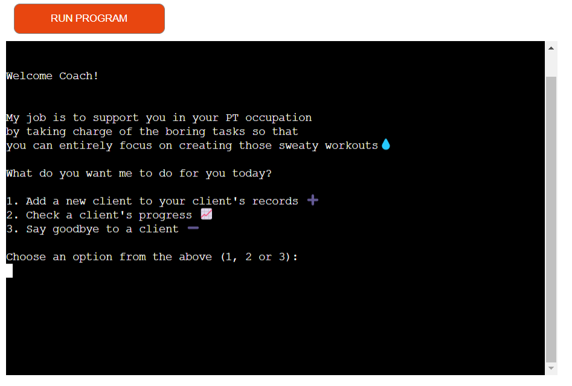
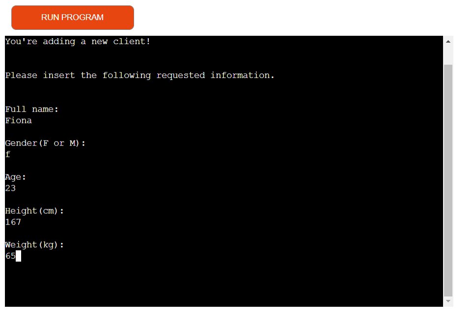
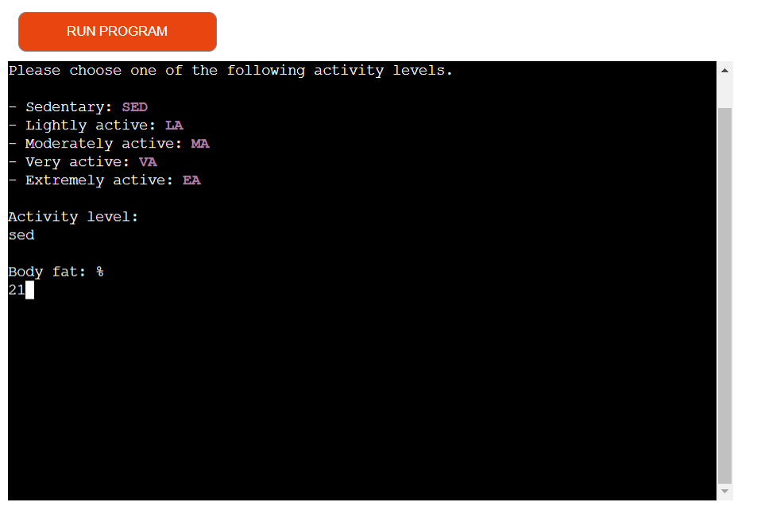
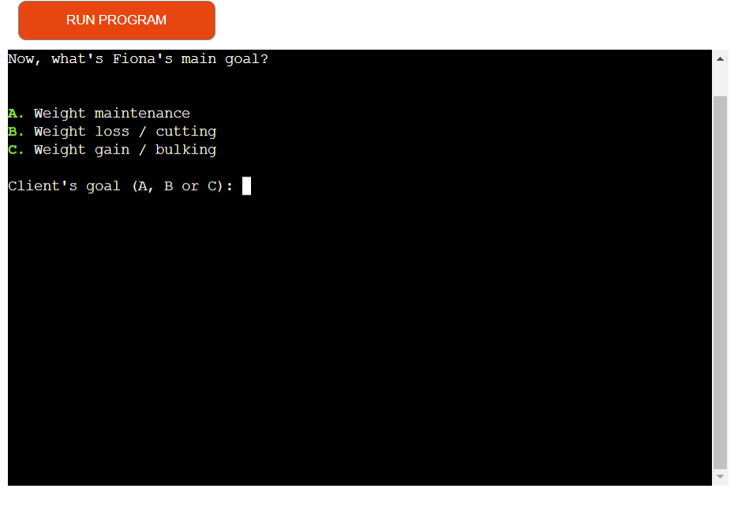
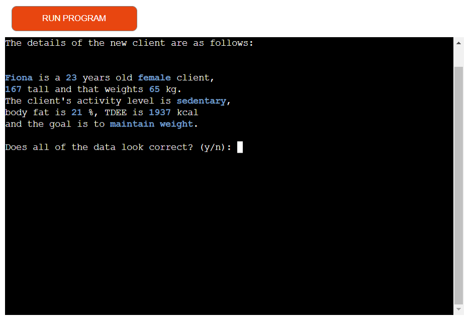
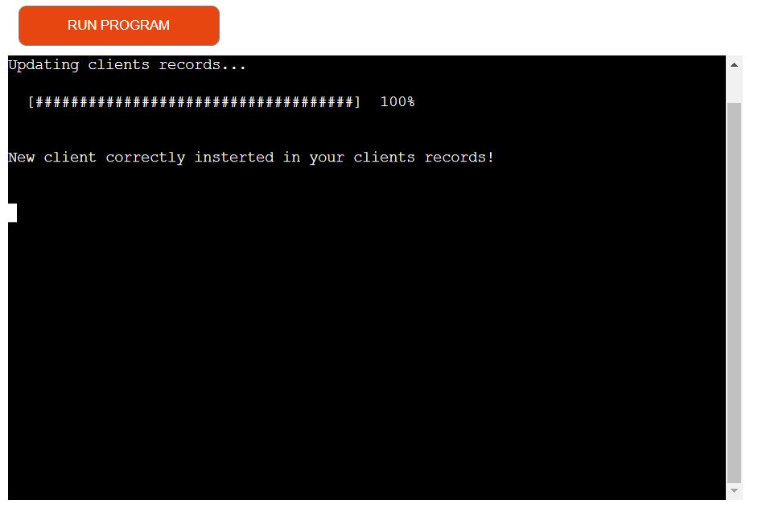
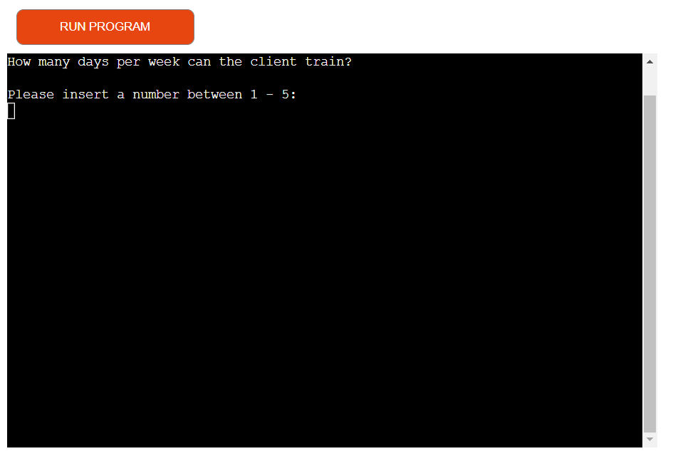
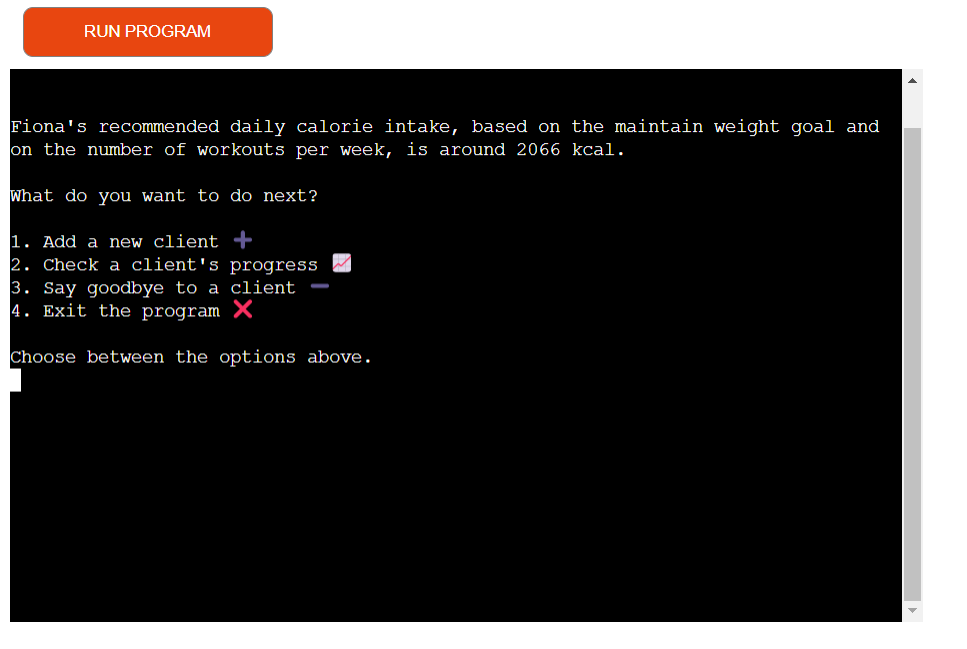

# YourPTFriend

**A Python based program to support Personal Trainers in their job**

[View the live program here](https://your-pt-friend.herokuapp.com/)

## TABLE OF CONTENTS

1. [INTRODUCTION](#1-introduction)
2. [INSTRUCTIONS](#2-instructions)
3. [USER STORIES](#3-user-stories)
4. [FEATURES](#4-features)
   - [Existing features](#existing-features)
   - [Features to implement in the future](#features-to-implement-in-the-future)
5. [TESTING](#5-testing)
6. [TECHNOLOGIES USED](#6-technologies-used)
7. [CREDITS](#6-credits)
8. [DEPLOYMENT](#7-deployment)
9. [ACKNOWLEDGEMENTS](#8-acknowledgements)

- - - 
## 1. INTRODUCTION & GOAL

__YourPTFriend__ is an interactable command-line based program built in Python that handles data automation as a _supporting tool for Personal Trainers_.

Since working out and nutrition go hand in hand, it happens very often that physical instructors are also required, besides their duties, to provide nutritional advice when first contacted.

This app provides support by taking charge of that nutritional aspect. By establishing the amount of daily calorie a new client should consume and allowing to keep track of clients' progress,
the PT can then entirely focus on his/her main responsibility: 
building an effective workout plan based on the client's need.

## 2. INSTRUCTIONS
The user can decide to:

1) __Add a new client to the records and obtain his/her daily calorie intake.__
The coach needs to provide a specific set of data (client's name, gender, age, height, weight, activity level, body fat and goal) for the program to calculate the right output. Data is then stored on a worksheet that contains all clients and their data.

2) __Periodically check a client's progress based on the weight goal and body fat percentages recorded.__
New weight and body fat percentages are required from the user.

3) __Delete a client from the records.__ 
Client's name is required.

## 3. USER PERSONA & THEIR GOALS/NEEDS
As a user I want to:
- have clear instructions/prompts on how to use the app
- be required to insert information that is easy and quick to gather and doesn't involve processing from my side
- obtain an accurate assessment of my clients' recommended daily calorie intake 
- obtain a reliable evaluation of my clients' progress
- have the option to choose another task after I'm finished with the current action
- have my inputs checked and validated so that the task outputs are even more reliable

## 4. FEATURES
- __START SCREEN__

The start screen displays the app name through an __ASCII art text__
that shows for the duration of _3.5 seconds_ (an appropriate time for allowing the user to take in the intro and at the same time not to get impatient) before the screen is cleared to show the next screen.

- __TASK CHOICE__

The introductory screen contains a brief explanation of the app's goal and prompts the user to choose between __3 different tasks__ that the app can perform.
Each option is accompanied by an _emoji_, for the purpose of making the app more engaging.

- __OPTION 1: ADD A NEW CLIENT__

When choosing the option to add a new client to the records, the PT is asked for the client's name, gender, age, height and weight.

The next piece of information requested is the client's activity level. The answer needs to be the actvity level's initials, as prompted from the magenta coloured foreground color of the answer options available.
Also the body fat percentage is requested in this screen.

The last data needed is the client's goal regarding the body weight. The client's name inserted in the previous screens is retrieved and displayed here to make the process less sterile. 3 options are made available and the answer needs to be one of the letters highlighted by the green foreground color.

The user is asked for confirmation of all of the inserted data before proceeding.
The inputted data are highlighted in a foreground blue color, that makes it easier to identify wrongly inserted data.

If the data is incorrect and the user insterts 'n', then all data will be asked again.

After approving the insterted data, the user is brought to a screen that confirms the successfull updating of the clients records.
This screen features a progress bar that has the purpose of giving the user a sense of awareness about the action that is happening behind the scenes.

The user is then prompted to inserting the client's committment to physical activity, choosing between 1 to 5 days per week. This piece of information is essential for calculating the daily calorie intake.

Finally, the newly added client's tailored daily calorie intake is displayed as the last feature of the adding a new client process. 
The result is displayed alone on the screen for 4 seconds, so that the information displayed has time to be fully absorbed before the user is prompted to choosing between accomplishing another task or exiting the program (and the user doesn't feel rushed).

## 5. TESTING

## 6. TECHNOLOGIES USED

## 7. CREDITS

## 8. DEPLOYMENT

## 9. ACKNOWLEDGEMENTS