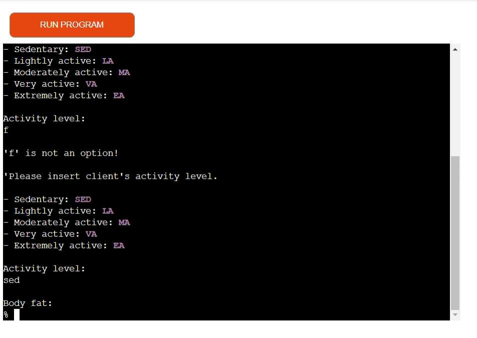
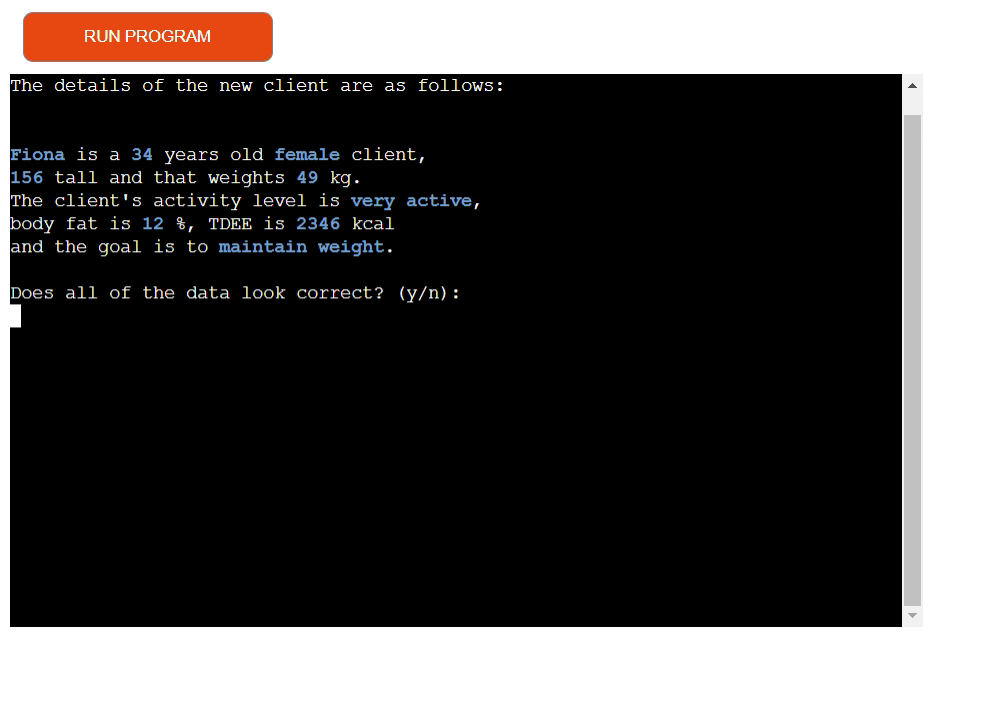
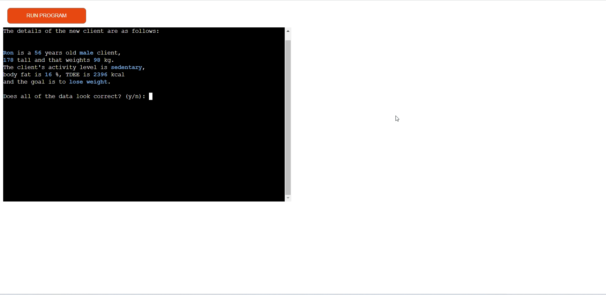
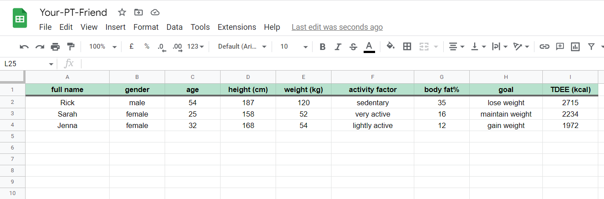

# YourPTfriend Testing

## TABLE OF CONTENTS

1) [Manual Testing](TESTING.md/#1-manual-testing)
    - [Task choice](TESTING.md/#task-choice)
        - [Input validation](TESTING.md/#input-validation)
        - [Task 1 option tested](TESTING.md/#task-1-option-tested)
        - [Task 2 option tested](TESTING.md/#task-2-option-tested)
        - [Task 3 option tested](TESTING.md/#task-3-option-tested)
        - [Task 4 option tested](TESTING.md/#task-4-option-tested)
    - [Add new client](TESTING.md/#external-links)
    - [Check client's progress](TESTING.md/#emailjs)
    - [Delete client](TESTING.md/#quiz--quiz-result)
    - [Exit program](TESTING.md/#quiz--quiz-result)
    - [Daily calorie intake functions](TESTING.md/#quiz--quiz-result)
2) [Code Validation](TESTING.md/#2-code-validation)
3) [Bugs and fixes](TESTING.md/#3-bugs-and-fixes)
3) [User testing](TESTING.md/#4-user-testing)

[⬅ Back to the README.md file](README.md)
- - - 
## 1) MANUAL TESTING

### TASK CHOICE

#### - __Input validation__
The task choice input has been validated to only accept one of the available tasks option. Empty strings, special characters, letters, numbers different from 1-4 are not accepted and the user gets a tailored prompt to insert the correct value. 

#### - __Task 1 option tested__
If option 1(_add a new client_) is chosen, the program correctly calls the _take_client_data()_ function to collect the new client data.

#### - __Task 2 option tested__
Option 2(_check a client's progress) selection correctly triggers the _check_progress()_ function.

#### - __Task 3 option tested__
The _delete_client()_ function to delete a client from the records is correctly called if option 3 is inputted in the task choice input.

#### - __Task 4 option tested__
When option 4 is chosen, the program correctly closes by giving the user goobye.

- - -
### ADD NEW CLIENT

#### - __Inputs validation__

##### __Name__
The name inputs only accepts values that are not: empty strings, numbers, special characters, names that are shorter than 3 letters or already existing names.

##### __Gender__
The input that asks for the client's gender validates that no empty strings or characters other than 'f' or 'm' are inserted.

##### __Age__
Only numbers between 14 and 100 are accepted into the client's age input. Also, empty strings are not allowed.

##### __Height__
The height input validation makes sure that empty strings are rejected and only numbers between 63 and 272 are accepted. The height of the shortest and the tallest person ever existed have been taken into account as parameters.

##### __Weight__
The weight input only accepts numbers between 24 and 635 (lightest and heaviest person ever recorded). No empty strings are allowed.
The validation comes from the _weight_validation function_ that is also called _when validating the client's new weight when checking the progress_.

##### __Activity level__
Nothing but the specific options available is accepted into the input that takes the client's activity level.

##### __Body fat__
Only numbers between 5 and 40 (realistic/possible parameters) are accepted in the body fat input.
_The same validation, coming from the body_fat_validation() function, is used when asking the user for the client's new body fat to check the progress (Task option 2: Check client's progress)._

##### __Goal__
The goal input is validated so that no empty strings, numbers, special characters or letters different from 'a', 'b' or 'c' are accepted.

##### __Confirm new client data__
When asking the user for confirmation related to the newly inserted data, the input validates that the user answers with either 'y' or 'n'.

##### __Client's availability__
The input that asks for the client's availability after updating the worksheets with the new client data, correctly validates that the user is not inserting empty strings, symbols, letters, numbers out of the range 1-5.

- - -
#### - __Client's data confirmation__

##### __Confirmed(y): Worksheets update__
When the user answers positively to confirm the new client's data, the _update_new_client_worksheet()_ and _update_clients_progress()_ functions are correctly triggered and the _clients initial conditions_ and _clients progress_ worksheets in the _Your-PT-Friend_ Google Sheets file are successfully updated with the new client data.

##### __Not confirmed(n): Restart take_client_data__
If the user answers with 'no' ('n') to the input asking for confirmation for the new user data, the _take_client_data()_ function is correctly called and the user is asked again for all of the data.

- - - 
#### - __Formulas__
All of the functions containing the formulas to calculate TDEE and reach the daily calorie intake have been manually tested using as an example 3 different fictional clients, each with a varied set of data, goal and weekly availability for workouts.

##### __tdee_formulas file__
If manually calculating the TDEE  using the formulas contained in _tdee_formulas.py_ file, the TDEE results obtained in the _clients initial conditions_ worksheet (screenshot above) prove to be accurate. 

1) __Rick__

LBM = 0.407 * 120 + 0.267 * 187 - 19.2 = 79.569

BMR = 79.569 * 21.6 + 370 = 2088.6904

TEF = 2088.6904 * 0.1 = 208.86904

TEA = (2088.6904 * 1.2) - 2088.6904 = 417.73808

__TDEE__ = 2088.6904 + 208.86904 + 417.73808 = _2715.29_(__2715__)

2) __Sarah__

LBM = 0.252 * 52 + 0.473 * 158 - 48.3 = 39.538  

BMR = 39.538 * 21.6 + 370 = 1224.0208  

TEF = 1224.0208 * 0.1 = 122.40208  

TEA = (1224.0208 * 1.725) - 1224.0208 = 887.41508  

__TDEE__ = 1224.0208 + 122.40208 + 887.41508 = _2233.83_(__2234__)

3) __Jenna__

LBM = 0.252 * 54 + 0.473 * 168 - 48.3 = 44.772

BMR = 44.772 * 21.6 + 370 = 1337.0752

TEF = 1337.0752 * 0.1 = 133.70752

TEA = (1337.0752 * 1.375) - 1337.0752 = 501.4032

__TDEE__ = 1337.0752 + 133.70752 + 501.4032 = _1972.18_(__1972__)

- - -
### CHECK CLIENT'S PROGRESS

#### - __Existing client's name__
When checking a client's progress, the input that asks for the client's name correctly validates that the name exists in the worksheets.

#### - __New body weight and fat validation__
I tested that also the new body weight and body fat inputs validation is working. 

